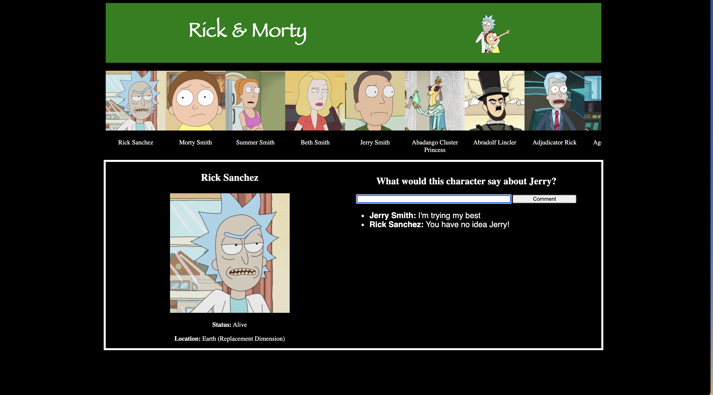

# Pursuit-Core-Module-Two-Practice-Final-Assessment

## Getting Started 
* Fork this repo
* Clone the forked repository
* `cd` to the directory where you cloned it
* `npm install` to install dependencies
* `npm test` to open the cypress testing window

> *Note*: Remember to `git add`, `git commit` and `git push` regularly

## Submission Guidelines
  * When finished, commit and push your work.
  * Make a pull request on github.
  * Submit the link to your pull request on Canvas. 

## Practice Assessment Details

Wubba lubba dub dub!!! Create an out of this world app using the [Rick And Morty API](https://rickandmortyapi.com/)! Your **burp** app should allow users to view characters and write what each character would say about Jerry. PS Nobody likes Jerry! 

See an app video [here](https://www.youtube.com/watch?v=bGyZYHU3cJ0) and can be played with [here](https://joinpursuit.github.io/Module-2-Practice-Final-Assessment/)

This **burp** app should have (in order of placement in the HTML):
- A title tag that starts with the text "Szechuan Sauce"
- A header tag. Make it mean and make it green. 
- Inside the header an `h1` that reads "Rick & Morty" with fantasy font.
- Inside the header an image of Rick and Morty (check your assets folder!)

- A `ul` with the id `all-characters` that contains an `li`'s with an image (id=`photo-img`) of each character in the API (first page only), as well as the characters name.
- A `main` tag that starts not on the page
- Inside of `main` should be two sections. The first section should have the id `character-info` the second should have the id `character-comments-section`.
- Inside of `character-info` should be be an `h3` an `img` and two `p` tags. 
- Inside of `character-comments-section` should be a `form`, including a "text" `input` and a "submit" `input`, that allows users to submit (not save, just add to the frontend) what they would say about the character Jerry. On submission the input should clear.
- Also insider `character-comments-section`  should be a `ul` with the id `character-comments-ul` that contains the submitted comments of each character.

Please feel free to include additional `section`s and elements if they make styling the **burp** app easier.

The user should be able to:

- Side scroll through the `all-characters` ul and click on a character. When they select a character, the `main` should appear and information about that character (name, image, status, location name) should populate in the `character-info` section. When they click on a different character, this information should be replaced. The page `title` should also match the name of the character selected. 
- Use the `form`, to submit a character comment. Each comment should be a new `li` inside of `character-comments-ul`, with the selected character's name (in bold) and a comment (not bold).

## Styling

Assume default styling unless explicitly articulated here. **Do not** utilize CSS Reset.

Your website should be responsive and work on screens of different sizes.

- **Body**
  - `black` background color.
  - Arrange content in a column, centered on the page width-wise.
- **Header**
  - Header should contain the `image` and `h1` tags.
  - Width: 70 percent. Height: 150px.
  - Image and header text should be horizontally oriented.
  - Image and header text should be on opposite sides of the header. Vertically, they should both be positioned in the center.
  - Image should have a height of 100px.
  - Header should have a margin of 20 pixels on the bottom.
  - Header background color should be `green`.
- **Main Area**'
  - Main area should contain all other content on the page.
  - Width: 70 percent.
  - Content should be oriented in a row
- **Comment Text Input**
  - The `text` input should have an explicit `width` of 380 pixels.

Your app should end up looking something like this:

